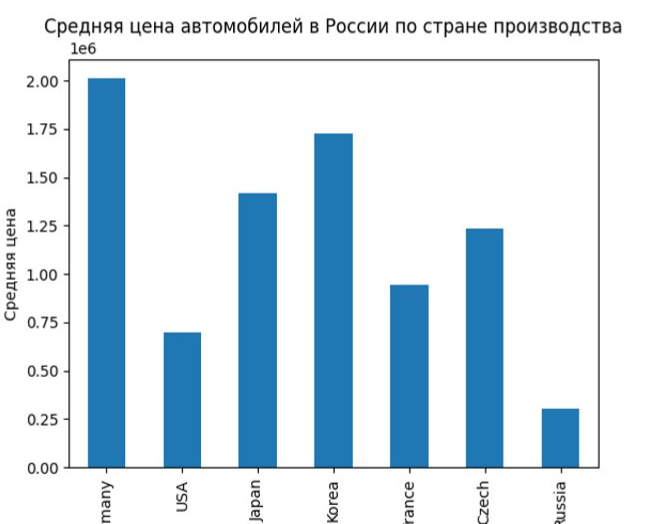
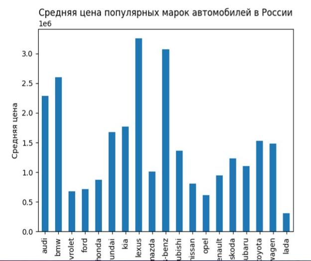
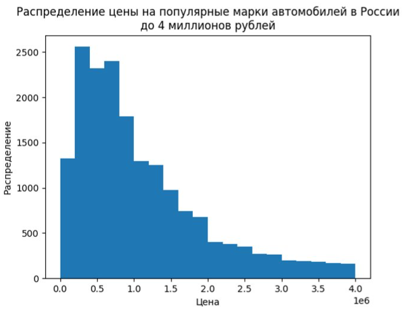
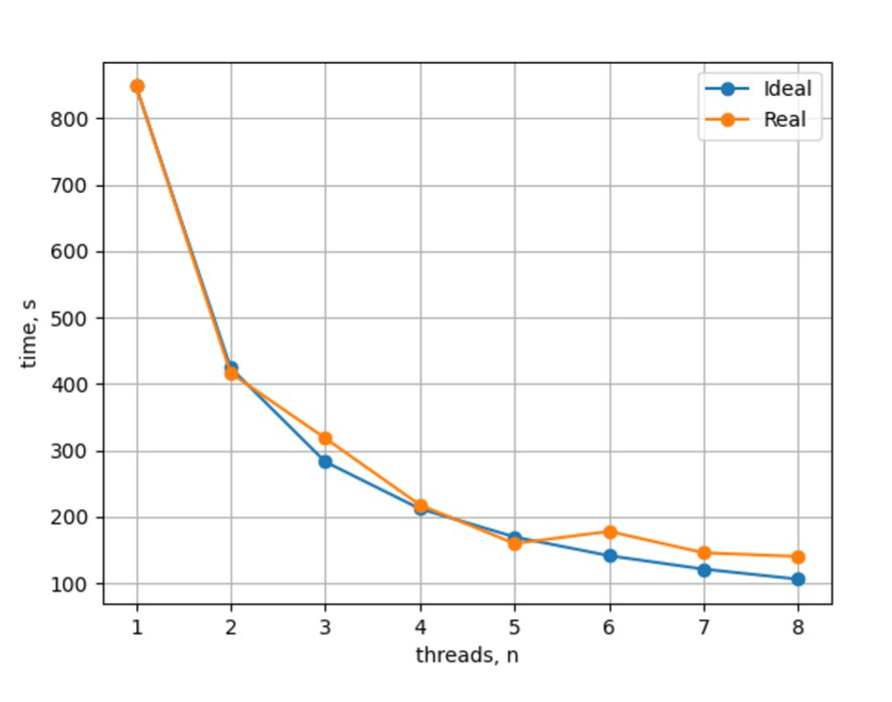

# parser_drom
Программа парсит популярные (по версии drom.ru) марки автомобилей на вторичном рынке и производит их анализ.

Применена многопоточность для оценки зависимости времени выполнения программмы от количества потоков

